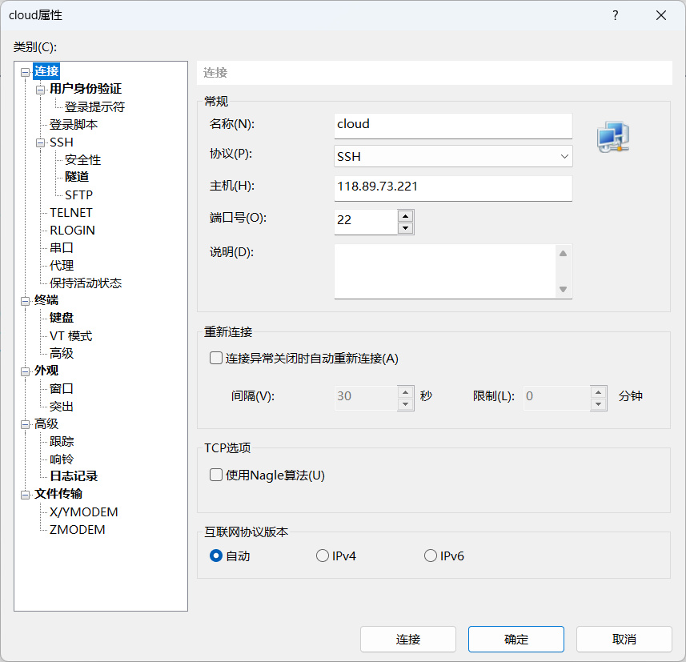
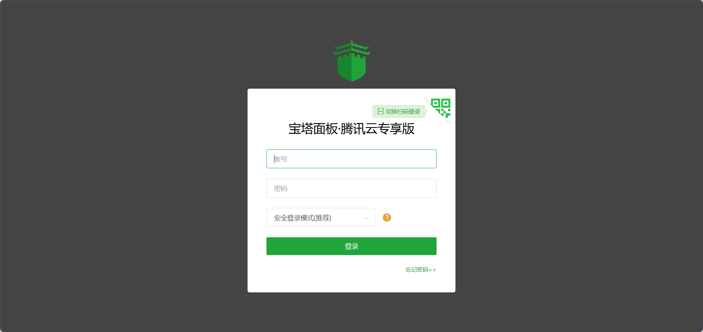

# 大事件部署

## 云服务器购买

首先在腾讯云申请使用云服务器，([云产品免费体验馆_云产品免费试用_个人云产品试用-腾讯云](https://cloud.tencent.com/act/pro/free))。

点击使用即可（这里选择腾讯云预装的宝塔服务器）：


## 宝塔面板

完成一系列验证后进入控制台点击`轻量级应用服务器`


点击`重置密码`来设置`root`密码等下登录时要用


通过远程连接工具`XShell`连接该实例




输入主机地址和用户名密码后连接到主机，在控制台输入(这里是root登录，可以不用sudo)

```bash
sudo /etc/init.d/bt default
```

此时会显示宝塔的用户名密码


此时需要在腾讯云设置防火墙放行端口，由于宝塔默认端口是`8888`，这里防火墙先放行`8888`，待会在宝塔面板可以改其端口（这里由于我改了面板为2090所以放行2090）


此时可以通过`http://[公网IP]:8888tencentcloud`来访问宝塔面板

输入刚刚获取到的账号密码即可登录



登录后会要求你绑定宝塔账号，这里不多赘述。

待完成后安装必要软件：`Ngnix`、`MySql`、`Redis`、`JDK`、`Node版本管理器`

## 部署后端

宝塔面板点击`文件`将要部署的Jar包传入`/www/wwwroot/`下，点击`网站->Java项目->添加Java项目`选择Jar包和合适的JDK（对于特殊项目还需要将项目用户设置为`root`。


### 添加环境变量

这里是通过命令的形式添加项目运行时环境变量

```bash
env ALIBABA_CLOUD_ACCESS_KEY_ID=id ALIBABA_CLOUD_ACCESS_KEY_SECRET=secret /www/server/java/jdk-17.0.8/bin/java  -jar -Xmx1024M -Xms256M  /www/wwwroot/big_event-0.0.1-SNAPSHOT.jar --server.port=8080
```


完成后点击确定后运行即可。

## 部署前端

首先将node项目通过宝塔面板的`文件`传到`/www/wwwroot/`下（千万不要带着node module一起传），然后点击`网站->node项目->添加node项目`。


这里有个坑会在**遇到的问题**中讲。

如果部署失败可以在宝塔面板的`终端`选项进入前端目录执行命令。

## 部署数据库

在宝塔面板下载号数据库之后可能需要远程连接，此时就可能会出现root用户不能远程访问的问题，也就是`root@localhost`,此时执行如下语句

```sql
-- 创建用户
CREATE USER 'root'@'%' IDENTIFIED BY '???';
-- 授权
grant all privileges on *.* to 'root'@'%' ;
```

这里还需要注意一点，如果这里的root远程的密码与本地root密码不一样可能会出现某些问题，所以此处为解决此问题，在宝塔面板查看数据库的root密码将SQL语句的`???`替换就行。

此外记得执行刷新权限表的SQL

```sql
FLUSH PRIVILEGES;
```

还不能连接？

在腾讯云服务器的防火墙下添加3306端口放行就行。


## 遇到的问题

`vue.config.js`在部署时，应该修改`server.host`来让`node.js`监听公网地址，所以需要在其文件中这样设置：

```javascript
import { fileURLToPath, URL } from 'node:url'

import { defineConfig } from 'vite'
import vue from '@vitejs/plugin-vue'
import { hostname } from 'node:os'

// https://vitejs.dev/config/
export default defineConfig({
  plugins: [
    vue(),
  ], 
  resolve: {
    alias: {
      '@': fileURLToPath(new URL('/src', import.meta.url))
    }
  },
  server: {
    proxy: {
      "/api": {
        target: "http://localhost:8080",
        changeOrigin: true,
        rewrite: (path)=>path.replace(/^\/api/,'')
      }
    },
    host: "0.0.0.0",
  }
})

```

如果不设置node.js会默认监听`127.0.0.1`此时即便你防火墙放开了通过公网IP访问前端界面也访问不了，会出现**已拒绝连接**的问题。

你可以通过[端口扫描 - 站长工具](https://tool.chinaz.com/port)来查看公网IP的对应端口是否开放。

同样地，假设需要将该`node.js`项目部署在`80`端口下也需要在此文件中加配置：

```javascript
import { fileURLToPath, URL } from 'node:url'

import { defineConfig } from 'vite'
import vue from '@vitejs/plugin-vue'
import { hostname } from 'node:os'

// https://vitejs.dev/config/
export default defineConfig({
  plugins: [
    vue(),
  ], 
  resolve: {
    alias: {
      '@': fileURLToPath(new URL('/src', import.meta.url))
    }
  },
  server: {
    proxy: {
      "/api": {
        target: "http://localhost:8080",
        changeOrigin: true,
        rewrite: (path)=>path.replace(/^\/api/,'')
      }
    },
    host: "0.0.0.0",
    port: 80
  }
})

```

但是这还不够，如果你在宝塔面板安装了`Nginx`则需要将其关闭，因为它占用了`80`端口，但是这还不够，因为在`linux`系统中，`1-1024`端口需要`root`权限，所以在启动`80`端口的`nodejs`项目时记得要在配置时选择`root`运行


## 项目地址

[大事件](http://www.webzank.site/login)->域名访问（因为需要备案暂时访问不了）

[大事件](http://118.89.73.221/)->公网ip访问
