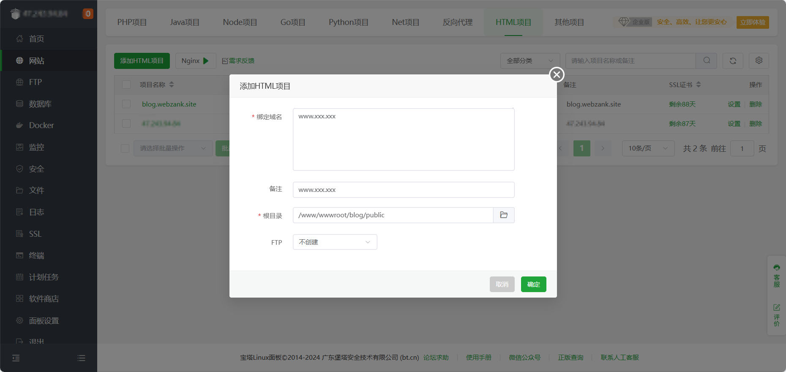
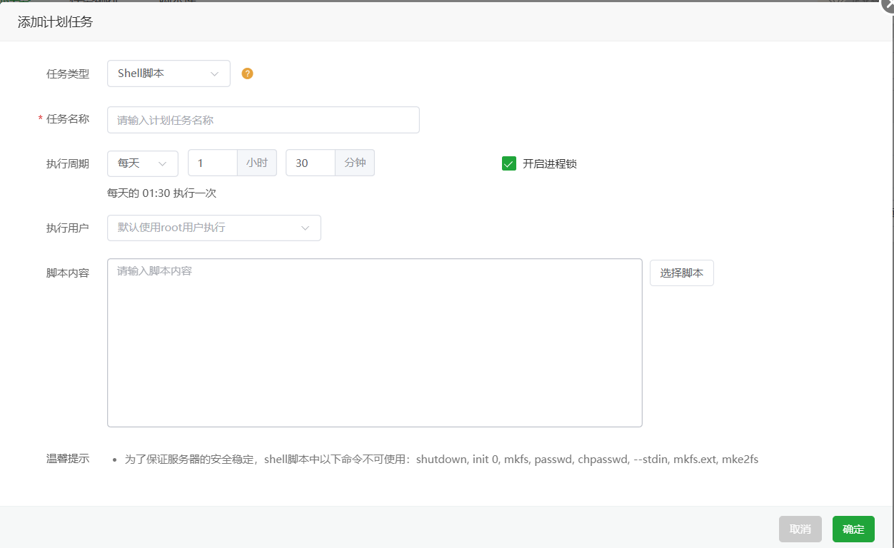

# Hexo使用前提
在安装hexo之前，请确保你下载了以下应用程序:
* Node.js
* Git

根据Hexo官网所述，Node.js 版本需不低于 10.13，且建议使用 Node.js 12.0 及以上版本。

至于Node.js和Git的安装，就不再此篇文章阐述了，我会在之后的文章中给出。

# 安装

Hexo的安装我们将要用到npm包管理器，然后输入以下命令

```bash
$ npm install -g hexo-cli
```


然后可以进行下一步：**建站**。

# 建站 

安装完Hxo之后，执行以下命令即可生成所需要的文件。

```bash
$ hexo init <folder> 
$ cd <folder>
$ npm install
```

其中<folder>中folder用你给你博客文件夹取的名字替换。

完成后显示如下信息：


新建文件夹完成后目录文件如下：

```
. 
├── _config.yml
├── package.json
├── scaffolds
├── source
|   ├── _drafts
|   └── _posts
└── themes
```

# 生成静态网页

执行完以上操作之后，你需要在博客的目录中输入以下指令完成静态网页的生成：

```bash
$ hexo g
```

grnerate 生成静态网页


然后使用localhost预览效果：

```bash
$ hexo s
```


双击 'http://localhost:4000/' 末尾的斜杆选中地址，右键open打开，效果如下：


记得使用完之后按下ctrl+C来关闭。

完成了这几步，那么恭喜你，你已经可以开始部署网站了。

# 网站的部署

首先，如果你下载了WebStorm，在其中打开刚刚创建的文件夹，然后创建Git仓库：


在你连接了远程仓库的情况下点击提交，勾选所有未进行版本管理的文件，输入提交信息后点击提交并推送，然后显示有警告需要经行代码分析，直接提交就是。

到这一步其实差不多就已经完成了，然后你可以用4everland来部署网站，别问为什么不用vercel，问就是加载太慢，以下是两者对比：

* 4everland：加载快，免费，但是部署有点慢，他是支持自动部署的。
* vercel：加载奇慢，有时候甚至完全打不开(毕竟节点在国外)，但是部署速度还算快，也能制动部署。
* 其他的还有cloudflare，这个好像速度也还行，但是我好像不怎么会用，所以感觉使用起来不如4everland。

那么以下我就只展示如何使用4everland来部署你的博客网站。

## 注册/登录/连接

首先进入4everland官网完成基本的注册登录，此处略去这些操作，在你登陆后，连接你的Github账号


## 部署

单击new project


在**Import Git Respository**下选择你博客文件的仓库，然后在**Build Configuration**下的Framework Preset选择Hexo，Build Command填写hexo generate，最后直接点击Deploy等待部署完成即可，部署完成后他会给出网址，点进去就能看到你的博客网站了。

## 域名修改

如果你有自己的域名，你可以在左侧**Hosting**下找到Project，单击后显示你的博客项目，点击设置，找到顶部的Domains，输入你的域名即可。

输入完后，你需要在域名解析中添加cname记录，将记录值填写为他给你的Value，name为你的域名的前半部分输入完后，你需要在域名解析中添加CNAME记录，将记录值填写为他给你的Value，name为你的域名的前半部分（例如，如果你的域名是"[www.example.com](www.example.com)"，那么填写的值应为'www'）。

# 第二种部署方式(服务器部署+定时更新)
以安装了宝塔面板的服务器为例，首先进入宝塔面板点击文件，将网站文件夹上床到`www/wwwroot/`目录下，这里建议传输的时候不要传`node modules`（主要是因为文件太多宝塔也上传不了），传完后重新

```bash
npm install
```

就行，因为hexo是通过

```bash
hexo generate
```

生成静态文件到`public`下，所以我们直接在宝塔面板选择**网站**->**HTML项目**，如何填写自己的域名，选择`public`位置就行


至于SSL证书在[部署SpringBoot+Vue的网站 - Zank的博客](https://blog.webzank.site/20241217/note/)一文有提到，这里不做阐述，域名添加使用A记录，指向服务器地址，这样就能通过域名访问我们的博客了。

### 定时更新

现在虽然网站已经能够访问了，但是还不够，因为这样部署的网站不能更新博客中的内容，这时候我们就能想到`linux`的`crontab`来开启定时任务，这里宝塔已经提供好了，先创建项目本地仓库，并添加远程仓库，然后再宝塔面板点击`计划任务`->`添加任务`



最主要的是填写好脚本内容：

```bash
#!/bin/bash

# 设置Node.js环境
export PATH=/www/server/nodejs/v18.19.1/bin:$PATH
# 或者使用nvm的情况
# export NVM_DIR="$HOME/.nvm"
# [ -s "$NVM_DIR/nvm.sh" ] && \. "$NVM_DIR/nvm.sh"

# 设置hexo命令路径（使用which hexo查看路径）
HEXO_PATH=/www/server/nodejs/v18.19.1/bin/hexo  # 根据实际路径修改

# 进入博客目录
cd /www/wwwroot/blog

#获取仓库更新
# 保存当前工作区的修改（如果有）
git stash

# 拉取最新代码并强制覆盖本地文件
git fetch --all
git reset --hard origin/master  # 如果是main分支就用origin/main
git pull origin master

# 恢复之前保存的修改（如果需要）
# git stash pop

# 更新子模块（如果有）
git submodule update --init --recursive

#更新依赖
npm i

# 执行hexo命令
$HEXO_PATH clean
$HEXO_PATH g

chown -R www:www /www/wwwroot/blog/public
chmod -R 755 /www/wwwroot/blog/public
```

完成后只需要在你的`windows`电脑上将更新的博客文章推送到远程仓库，服务器就会定时拉取更新然后重新生成静态页面，这样就实现了定时更新。